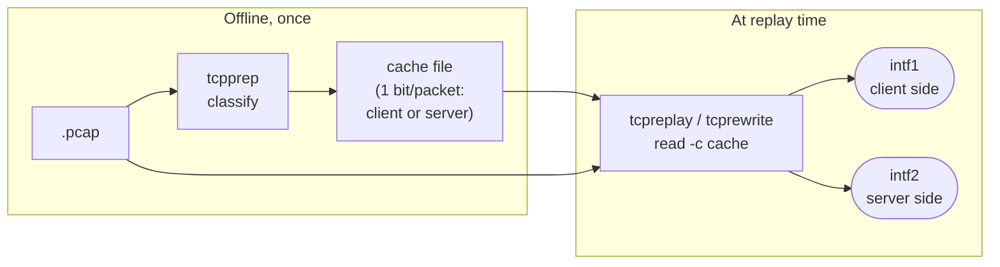

# The tcpprep cache pipeline

A single capture mixes both directions of every conversation — client-to-server
and server-to-client packets, interleaved. To drive an **in-line** device (one
that sits *in* the traffic path, like a firewall or IPS), you need to send the
client packets out one NIC and the server packets out the other, so the device
sees traffic arriving from both sides as it would in reality.

Deciding which packet is which is the job of [`tcpprep`](../tools/tcpprep.md),
and the decision is recorded in a **cache file**.

## The three stages

1. **Classify (offline).** `tcpprep` reads the capture and builds a model of who
   is talking to whom — a tree of IP or MAC addresses, depending on the mode.
   From that it labels every packet *client-to-server* or *server-to-client*.

2. **Cache.** Those labels are written to a compact cache file: essentially one
   decision per packet, in capture order. The cache is tiny compared to the
   pcap and contains no packet data — just the direction stream.

3. **Consume (at replay/rewrite time).** `tcpreplay` and `tcprewrite` read the
   cache with `-c` / `--cachefile` alongside the original pcap. Because the cache
   is in the same order as the packets, each tool knows, packet by packet, which
   direction it belongs to — and therefore which interface to send it out, or
   which set of rewrite rules to apply.

## Why split it out?

- **Determinism.** The classification is computed once and frozen. Every replay
  from that cache makes identical direction choices — essential for repeatable
  tests.
- **Performance.** Classification can be expensive; the real-time send path
  should not be. Doing it offline keeps the hot loop to a simple lookup.
- **Inspectability.** You can examine a cache (`tcpprep --print-info`) or record
  how it was made (`--comment` / `--print-comment`) without re-running anything.

## Classification is a heuristic

There is no ground truth for "client" and "server" in an arbitrary capture, so
`tcpprep` offers several strategies — split by MAC, by subnet, by well-known
port, by regex, or by an automatic inference mode. Choosing the right one is
about matching the heuristic to your capture's topology; see the
[`tcpprep` modes](../tools/tcpprep.md#classification-modes). When in doubt,
`--print-info` lets you check the split before committing to a test, and
`--reverse` flips it if the sides came out backwards.

## Format compatibility

The cache format is a contract between the producer (`tcpprep`) and the consumers
(`tcpreplay`, `tcprewrite`). Keep them from the same suite version to be safe; a
cache is meaningless without the exact pcap it was built from, since it indexes
packets by position.

## See also

- [Splitting client/server traffic](../guides/client-server-split.md) — the
  hands-on recipe.
- [`tcpprep`](../tools/tcpprep.md) — the classification modes in detail.
