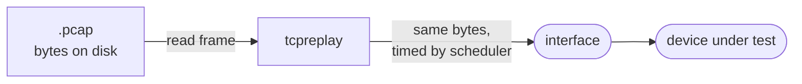

# The replay model

## Replay is not a network stack

When you run `tcpreplay`, it does **not** open sockets, negotiate connections,
or let the kernel build packets for you. It takes the bytes of each frame
exactly as they were captured and hands them to the interface to transmit. The
capture *is* the traffic.

That has a crucial consequence: **the packets carry whatever addresses, ports
and sequence numbers were in the capture.** `tcpreplay` doesn't rewrite them and
doesn't care whether anything answers. If you want the traffic to make sense to
a specific device — right MACs, right subnet — you rewrite it first with
[`tcprewrite`](../tools/tcprewrite.md), or replay through
[`tcpreplay-edit`](../tools/index.md#tcpreplay-and-tcpreplay-edit).

This is exactly what you want for testing network *devices* — switches,
firewalls, IDS/IPS, NetFlow collectors — because they operate on packets as they
appear on the wire, not on established sessions.

## Layer 2 by default

Because it replays whole frames, `tcpreplay` naturally works at **Layer 2**: it
reproduces the Ethernet (or other link-layer) framing byte-for-byte. It does not
route, ARP, or fragment on your behalf. When you need Layer 3+ awareness — for
instance to make one capture look like traffic between two specific endpoints —
that intelligence comes from the *editing* step, not the send.

There are two deliberate exceptions to the pure-Layer-2 model:

- **`--raw`** injects through a PF_INET raw IP socket, so the kernel's IP stack
  (routing, netfilter) processes the packet. This trades Layer 2 fidelity — the
  kernel builds its own framing — for stack integration, and is IPv4-only.
- **`tcpliveplay`** is a different tool entirely: it *does* run a real TCP
  conversation, up the full stack. See
  [`tcpliveplay`](../tools/tcpliveplay.md).

## Captured length vs original length

A pcap record stores two lengths: **caplen**, the number of bytes actually saved,
and **len**, the packet's original length on the wire. When a capture is taken
with a small snap length, `caplen < len` — the tail of each packet was never
saved.

`tcpreplay` can only send bytes it has, so it sends `caplen` bytes. This matters
when you benchmark: a truncated capture will report less data than the original
traffic carried. [`tcpcapinfo`](../tools/tcpcapinfo.md) shows both lengths so you
can spot truncation before it skews a test.

## What "success" means

`tcpreplay`'s statistics count packets *handed to the interface successfully*,
not packets *received* by anything. A clean run with zero failures means the
host transmitted every frame — whether a device downstream saw them, and what it
made of them, is measured on the *other* end (with a capture, a counter, or the
device's own stats). Designing that measurement is the real work of a
[performance test](../guides/performance-testing.md).

## See also

- [Timing & speed control](timing-and-speed.md) — how the send is paced.
- [The tcpprep cache pipeline](prep-cache-pipeline.md) — adding direction awareness.
