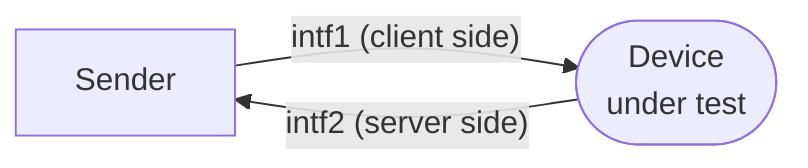

# Splitting client/server traffic

To test an **in-line** device — one that sits *in* the traffic path, like a
firewall, IPS or transparent proxy — you need to present it with traffic arriving
from both sides, exactly as it would in production: client packets from one
interface, server packets from the other. This guide builds that two-NIC replay.

The mechanism is the [tcpprep cache pipeline](../concepts/prep-cache-pipeline.md):
classify once, then replay direction-aware.



## Step 1 — classify the capture

Choose the [`tcpprep` mode](../tools/tcpprep.md#classification-modes) that matches
your capture's topology and write a cache file:

=== "Split by MAC (bridge)"

    ```console
    $ tcpprep --auto=bridge --pcap=in.pcap --cachefile=in.cache
    ```

    Good when the two sides have distinct MAC addresses.

=== "Split by subnet (router)"

    ```console
    $ tcpprep --auto=router --pcap=in.pcap --cachefile=in.cache
    ```

    Good when client and server live on different IP networks.

=== "Split by network (explicit)"

    ```console
    $ tcpprep --cidr=10.1.0.0/16 --pcap=in.pcap --cachefile=in.cache
    ```

    Everything in `10.1.0.0/16` is the client side; everything else is the server
    side.

## Step 2 — check the split

Before wiring up a test, confirm the classification looks right:

```console
$ tcpprep --print-info --cachefile=in.cache --pcap=in.pcap
```

If the sides came out backwards, either re-run with `--reverse` or add it when
consuming the cache.

## Step 3 — replay across two NICs

Hand both the capture and the cache to `tcpreplay`, naming both interfaces:

```console
$ sudo tcpreplay -i eth0 -I eth1 -c in.cache in.pcap
```

- `-i` / `--intf1` carries the **client** side.
- `-I` / `--intf2` carries the **server** side.
- `-c` / `--cachefile` is the classification from Step 1.

`tcpreplay` walks the capture and the cache in lock-step, sending each packet out
the interface its direction dictates. The DUT sees a coherent two-sided
conversation.

## Retargeting each side differently

Because the cache encodes direction, `tcprewrite`'s two-valued options let you
rewrite the client and server halves independently — for example giving each side
the MAC of the DUT port it faces. Do that offline first, then replay the edited
file with the same cache:

```console
$ tcprewrite -c in.cache --infile=in.pcap --outfile=lab.pcap \
    --enet-dmac=00:11:22:33:44:55,66:77:88:99:aa:bb \
    --fixcsum
$ sudo tcpreplay -i eth0 -I eth1 -c in.cache lab.pcap
```

The two comma-separated MACs apply to the client and server directions
respectively.

## See also

- [The tcpprep cache pipeline](../concepts/prep-cache-pipeline.md) — how this works.
- [`tcpprep`](../tools/tcpprep.md) — all classification modes.
- [Rewriting packet headers](rewriting-headers.md) — direction-aware edits.
