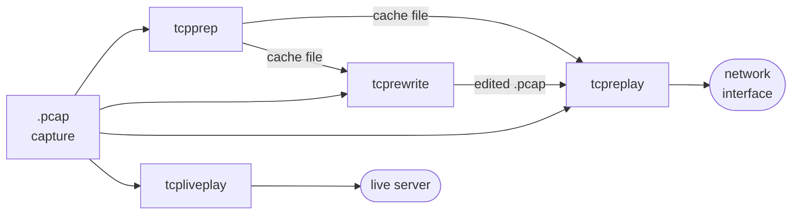

# The tools

The suite is six focused command-line tools built from a shared codebase. Each
does one job well; you compose them into a workflow.

<div class="grid cards" markdown>

-   :material-play-speed: **[tcpreplay](tcpreplay.md)**

    ---

    Replay pcap files onto the network at arbitrary speeds — original timing,
    a fixed rate, or line rate.

-   :material-play-box-edit-outline: **[tcpreplay-edit](tcpreplay-edit.md)**

    ---

    `tcpreplay` with `tcprewrite`'s editing folded in — rewrite headers and
    replay in a single pass.

-   :material-file-replace: **[tcprewrite](tcprewrite.md)**

    ---

    Rewrite Layer 2–4 headers in a pcap: MACs, IPs, ports, VLANs, checksums,
    DLT.

-   :material-account-switch: **[tcpprep](tcpprep.md)**

    ---

    Classify each packet as client or server and write a cache file the other
    tools consume.

-   :material-bridge: **[tcpbridge](tcpbridge.md)**

    ---

    Bridge two segments, rewriting packets in flight with the same engine as
    `tcprewrite`.

-   :material-server-network: **[tcpliveplay](tcpliveplay.md)**

    ---

    Replay a captured TCP session against a live server, exercising the full
    stack.

-   :material-file-search: **[tcpcapinfo](tcpcapinfo.md)**

    ---

    Decode and debug the raw structure of a pcap file.

</div>

## How they fit together

The tools are designed to pipe into one another through files:



- **`tcpprep`** reads a capture once and writes a compact *cache file* that
  labels every packet client-to-server or server-to-client.
- **`tcprewrite`** and **`tcpreplay`** can both read that cache (`-c`) to make
  direction-aware edits — for example sending client packets out one NIC and
  server packets out another.
- **`tcprewrite`** edits a capture into a new file; **`tcpreplay`** puts packets
  on the wire.
- **`tcpliveplay`** is the exception: it doesn't just push Layer 2 frames, it
  carries on a real TCP conversation with a live server.

See [The tcpprep cache pipeline](../concepts/prep-cache-pipeline.md) for the
full story.

## `tcpreplay` and `tcpreplay-edit`

When the suite is built with editing support, [`tcpreplay-edit`](tcpreplay-edit.md)
is produced alongside `tcpreplay`. It is `tcpreplay` **plus** every rewriting
option from `tcprewrite`, so you can edit and replay in a single pass without an
intermediate file. Plain `tcpreplay` omits the editing engine and is the lean
choice when you only need to send an unmodified capture. See its
[own page](tcpreplay-edit.md) for details.

## Full option reference

These pages are task-oriented. For the complete, authoritative list of every
option a tool accepts, see the [man pages](../reference/man-pages.md) or run:

```console
$ tcpreplay --help
```
